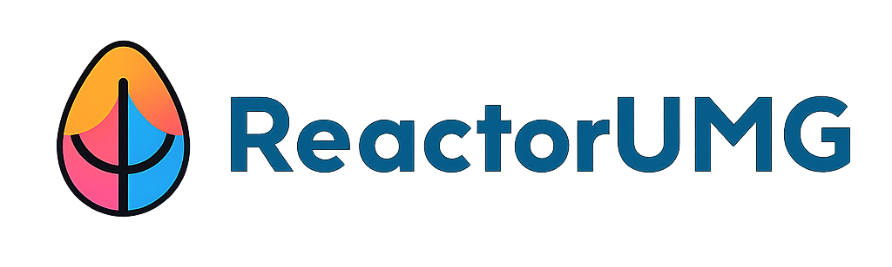

<h1 id="reactorumg">ReactorUMG</h1>

**这部分为ReactorUMG插件配套的TypeScript运行脚本，已发布为NPM包**

ReactorUMG是一款可以帮助您在虚幻引擎（Unreal Engine）中使用 **React** 开发 **UMG** 游戏UI和编辑器UI的辅助插件。
插件基于 **PuertTS** 脚本能力构建，结合 AI 辅助，让您能以Web前端的开发方式高效完成游戏UI和编辑器UI的研发与迭代。**特别适用于使用AI快速开发出编辑器下的各类UI工具。**

> **关键词**：Unreal Engine、UE5、UMG、UI、Slate、React、TypeScript、插件、热重载、实时预览、Puerts

⚠️ **当前为开发测试阶段（Alpha）**：API 与结构仍可能变化；稳定后将发布正式版本。鉴于游戏内UI通常具有较高的视觉和交互复杂度，当前版本的插件在适配完整度方面尚难以完全满足产品级游戏UI的表现需求。**因此，现阶段我们强烈建议优先将其应用于编辑器扩展工具的UI开发中，实现工具开发提效。**

⚠️ **使用前注意**：**使用开发前请务必查看FAQ，避免您重复踩坑。**

---

<h2 id="767fa455">目录</h2>

+ [为什么使用ReactorUMG](#ca757ae1)
+ [核心特性](#d2ffce75)
+ [系统要求](#19c93d0a)
+ [安装与快速上手](#2e52a2da)
+ [项目结构示例](#f2407408)
+ [FAQ](#faq)
+ [路线图](#c644eeae)
+ [贡献指南](#f31ccad5)
+ [许可证](#20a28457)
+ [链接与资源](#477c63ed)

---

<h2 id="ca757ae1">为什么使用ReactorUMG</h2>

虚幻引擎的UI开发组件 UMG 足够强大，但**缺少文本化/可编程的前端生态**，难以直接套用 AI/前端工程体系（如组件化、热重载、静态检查、自动化测试等）对想要快速完成迭代的开发人员来说不是非常友好。  
为了解决这个需求痛点，我们开发出了ReactorUMG插件，**ReactorUMG** 允许您用 **原生 React + TypeScript** **+ AI**来快速构建游戏UI或编辑器UI，**所见即所得，支持实时预览和编辑时热更新**，把 Web 前端的最佳实践与游戏 UI 开发连接起来。

---

<h2 id="d2ffce75">核心特性</h2>

+ **原生 React 体验**：支持 React Hook 、函数/类组件、TSX语法、React容器布局、React原生组件、UMG组件。
+ **脚本化交互**：使用 PuerTS 调用引擎和编辑器脚本接口，平替蓝图逻辑。
+ **AI辅助开发**：使用 AICoding 快速搭建编辑器工具面板、运行时UI、设计可复用组件库等。
+ **实时预览**：热重载验证、编辑器实时预览，快速验证布局与交互。
+ **示例齐全**：提供从入门到进阶的示例与模板。
+ **UI动画**: 支持导入spine和Rive UI动画。

---

<h2 id="19c93d0a">开发系统要求</h2>

+ Unreal Engine **5.x**
+ **Node.js ≥ 18** 与 **Yarn / PNPM / NPM**（任选其一）
+ VSCode / Cursor（建议）
+ Windows 10/11，Linux

---

<h2 id="2e52a2da">安装与快速上手</h2>

**极简版**
+ 下载插件并放置到项目`Plugins`目录；
+ 运行初始化脚本`Plugins/ReactorUMG/Tools/setup_win.bat`；
+ 启动项目，创建`ReactorUMG->EditorUtilityWidget`资产，到`<ProjectDir>/TypeScript/<ProjectName>/Editor/<AssetName>`下编写UI脚本。

详细信息参考文档：https://caleb196x.github.io/ReactorUMGOnlineDoc/quickstart/

---

<h2 id="x0qyv">运行时UI支持平台</h2>

+ Windows、Android、Linux

<h2 id="faq">FAQ</h2>

**Q: 和原生 UMG/Slate 的关系？**  
A: ReactorUMG 面向“用 React 构建 UI”的团队，与 UMG/Slate 互补；底层仍依赖 UE 的 UI 渲染体系与脚本桥接。

**Q: 性能如何？**  
A: UI 复杂度与状态变更频率会影响性能。推荐进行组件颗粒度控制、状态下沉、减少不必要重渲染，并按需关闭开发时的调试开销。

---

<h2 id="c644eeae">路线图</h2>

- [x] 支持基本react原生组件和基础CSS样式
- [ ] 设计以ReactorUMG为核心的组件库，提供复杂游戏UI开发能力，提高运行效率和稳定性
- [ ] 支持tailwind css
...

想要的功能不在清单里？欢迎在 Issues 中提交需求。

---

<h2 id="f31ccad5">贡献指南</h2>

我们欢迎所有形式的贡献：Bug 反馈、文档修订、新特性提案与 PR。

1. Fork 仓库并创建分支：`feat/your-feature` 或 `fix/your-bug`
2. 运行本地示例验证变更
3. 提交 PR，并简要说明动机、影响范围与测试方式

详情请见 **CONTRIBUTING.md**（将提供提交流程、代码规范、提交信息规范等）。

---

<h2 id="20a28457">许可证</h2>

本项目采用 **MIT License**。详见 [**LICENSE**](https://chatgpt.com/c/LICENSE)。

---

<h2 id="477c63ed">链接与资源</h2>

+ **文档主页**：https://caleb196x.github.io/ReactorUMGOnlineDoc/
+ **示例工程**：https://github.com/Caleb196x/ReactorUMGDemo
+ **发行版下载（Releases）**：__
+ **问题与建议（Issues）**：__
+ **讨论区（Discussions）**：__

---

✨ 如果这个项目对你有帮助，欢迎 **Star**、**分享**，并告诉我们你的使用场景与需求！
